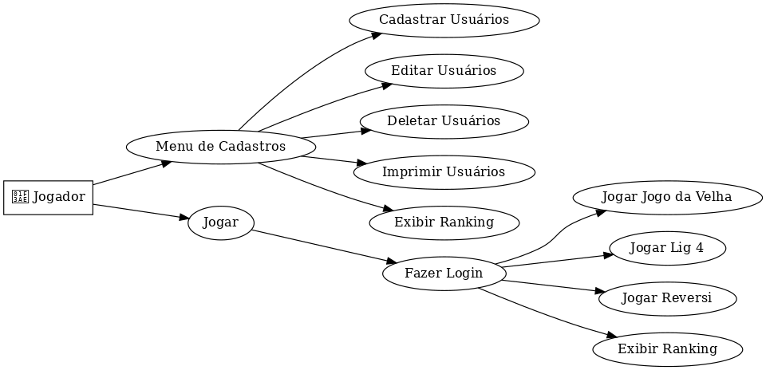

<h1 align="center"> 🃏Projeto Final - Jogos de Tabuleiro 🃏</h1>


<div align="center">
  <strong> 🚀 Sistema de implementação de Jogos de Tabuleiro 🧮</strong>
</div>

<div align="center">
  <p>  Um repositório incrível com um projeto espetacular desenvolvido por: </p><p>🎲 Gustavo Vieira, Daniel Canton e Thiago Almeida! 🎲 </p>
  <p>Aqui você encontrará informações sobre o projeto, tecnologias utilizadas, instruções para configurar o ambiente de desenvolvimento e muito mais.</p>
</div>

## 📖 Índice

- [Visão Geral](#visão-geral)
- [Critérios de avaliação](#criterios-de-avaliação)
- [Tecnologias](#tecnologias)
- [Jogos Implementados](#regras-dos-jogos)
- [Premissas Assumidas](#premissas-assumidas)
- [Decisões de Projeto](#decisões-de-projeto)
- [Configuração do Ambiente](#configuração-do-ambiente)
- [Como jogar](#como-jogar)

## 🔭 Visão Geral

Nosso objetivo com este trabalho é desenvolver um sistema utilizando o paradigma de orientação a objetos para implementar alguns jogos de tabuleiro, especialmente o Reversi, o Lig 4 e o jogo da velha. Vamos implementar uma hierarquia de classes que permita a criação de diferentes jogos, bem como um sistema de cadastro de jogadores que possibilite a manutenção de estatísticas.
Além da modelagem e implementação, utilizaremos ferramentas que permitam o controle de versão e desenvolvimento colaborativo, a realização de testes e a criação da documentação.
Devemos lembrar que o objetivo não é apenas escrever um programa funcional, mas desenvolver um sistema confiável, reutilizável e de fácil manutenção e extensão. Por isso, aplicaremos todos os conceitos de POO, modularidade e corretude abordados em sala de aula.
Também buscamos explorar a criatividade nas soluções propostas, além de nos esforçarmos para implementar funcionalidades extras que possam agregar valor ao sistema.


- Login
- Criação de Usuário
- Hierarquia de Classes para Jogos
- Execução de Partidas
- Testes Unitários
- Extras
    - Menu interativo
    - Animações do jogo Reversi  
    - Ranking dos vitoriosos

## Foi levado em consideração o seguinte Diagrama de Caso de Uso:



## A documentação com todos os detalhes das rotas se encontra em /api e segue da seguinte forma:
A documentação do projeto foi gerada utilizando a ferramenta Doxygen e pode ser encontrada na pasta data, disponível nos formatos HTML e LaTeX. O formato HTML oferece uma navegação simples e intuitiva, enquanto o LaTeX pode ser usado para gerar documentos PDF detalhados. Essa documentação inclui detalhes sobre as classes, métodos e funcionalidades implementadas no sistema.

## 📋 Critérios de avaliação 
Foram seguidos os seguintes critérios:

- [x] Modelagem
- [x] Clareza e legibilidade
- [x] Documentação amigavel
- [x] Implementação correta, sem bugs
- [x] Uso das técnicas de POO

      
## 💻 Tecnologias

- C++

## 🧩 Jogos Implementados 

 A seguir, serão apresentados os jogos desenvolvidos e implementados ao longo de todo o projeto. Em cada caso, será descrito detalhadamente o funcionamento de cada jogo, bem como suas principais regras, estratégias básicas e características que o tornam único. Essa explicação tem como objetivo oferecer uma visão clara e completa sobre o desenvolvimento e a lógica aplicada, além de destacar os aspectos fundamentais para a jogabilidade e diversão.


## 1️⃣ Lig4

Como funciona o jogo:

  - Tabuleiro: O tabuleiro é composto por uma grade vertical com 7 colunas e 6 linhas.
  - Peças: Cada jogador tem peças de uma cor específica (normalmente, vermelha e amarela).
  - Turnos alternados: Os jogadores se revezam para jogar, inserindo uma peça em qualquer uma das colunas disponíveis. A peça desliza para o ponto mais baixo da coluna, empilhando-se sobre as outras, se houver.
  - Objetivo: O primeiro jogador que conseguir alinhar quatro peças consecutivas vence.

Regras principais:

  - Jogada válida: As peças só podem ser inseridas em colunas que ainda tenham espaço disponível.
  - Empate: Se o tabuleiro for completamente preenchido e nenhum jogador tiver formado uma linha de quatro peças, o jogo termina empatado.
  - Interrupção: Um jogador pode bloquear a sequência do adversário ao colocar uma peça na sua linha de potencial vitória.
    
## 2️⃣ Reversi

Como funciona o jogo:

  - Tabuleiro: O jogo é jogado em um tabuleiro 8x8.
  - Peças: Cada jogador tem peças de dois lados (normalmente pretas e brancas).
  - Posicionamento inicial: O jogo começa com quatro peças dispostas no centro do tabuleiro, formando um quadrado de 2x2, com duas peças brancas e duas pretas em diagonais opostas.
  - Turnos alternados: Os jogadores se revezam para colocar suas peças no tabuleiro, com a regra de capturar peças do oponente ao cercá-las em linha reta (horizontal, vertical ou diagonal).
  - Objetivo: O jogador com mais peças da sua cor no tabuleiro ao final do jogo vence.

Regras principais:

  - Captura de peças: Ao colocar uma peça, ela deve flanquear (cercar) uma ou mais peças do oponente entre a peça recém-colocada e outra peça já existente da sua cor. As peças cercadas são viradas para o lado do jogador.
  - Jogada válida: Se um jogador não puder fazer uma jogada que capture peças do oponente, ele perde a vez.
  - Fim do jogo: O jogo termina quando o tabuleiro está cheio ou nenhum jogador pode fazer uma jogada válida.

## 3️⃣ Jogo da Velha

Como funciona o jogo:

- Tabuleiro: É jogado em um tabuleiro de 3x3.
- Peças: Cada jogador representa um símbolo (geralmente "X" e "O").
- Turnos alternados: Os jogadores se revezam para marcar uma célula vazia do tabuleiro com o seu símbolo.
- Objetivo: O primeiro jogador que conseguir formar uma linha de três símbolos consecutivos na horizontal, vertical ou diagonal vence.

Regras principais:

  - Jogada válida: O jogador só pode marcar células que ainda estejam vazias.
  - Empate: Se todas as células forem preenchidas e nenhum jogador tiver formado uma linha de três símbolos, o jogo termina empatado.
  - Fim imediato: Assim que um jogador forma uma linha de três símbolos consecutivos, o jogo termina imediatamente.

  ## 📜Premissas Assumidas
- O sistema foi projetado para ser executado em ambientes Linux ou Windows com suporte ao padrão C++17.
- A entrada de dados será confiável e não será necessário tratamento extensivo de erros.
- Todas as informações do jogador e estatísticas são manipuladas em memória ou salvas em arquivos simples.
- A interação será feita exclusivamente por meio de uma interface de linha de comando (CLI).

## ⚙️Decisões de Projeto
- **Hierarquia de Classes**: Uma estrutura base foi implementada para os jogos, permitindo reutilização de lógica comum, como inicialização de tabuleiros e controle de turnos.
- **Persistência de Dados**: Não foi utilizado banco de dados, mas as informações podem ser salvas em arquivos de texto.
- **Reutilização de Código**: Funções comuns foram abstraídas em classes base e métodos genéricos.
- **Documentação e Modularidade**: O projeto foi dividido em módulos claros, com documentação detalhada para facilitar a manutenção e extensão futura.

## 💻Configuração do Ambiente
1. **Instale o Compilador**:
   - **Linux**:
     ```bash
     sudo apt update
     sudo apt install build-essential g++
     ```
   - **Windows**:
     - Instale o MinGW ou utilize o WSL com suporte a compiladores Linux.

2. **Clone o Repositório**:
   ```bash
   git clone https://github.com/Trabalho-final-PDS2/Trabalho_Final.git
   cd Trabalho_Final
   ```

3. **Compilação e Execução**:
   - **Usando CMake**:
     ```bash
     cd Trabalho_Final
     make (caso não seja possível compilar de primeira, use um make clean e tente o make novamente)
     cd bin
     ./login
     ````

## 🎮Como Jogar
1. Execute o programa:
   ```bash
   cd Trabalho_Final
   ./login
   ```
2. Escolha a opção desejada no menu:
   - Jogar.
   - Menu de Cadastros.
   - Sair.
3. Siga as instruções exibidas para cada módulo.


    
